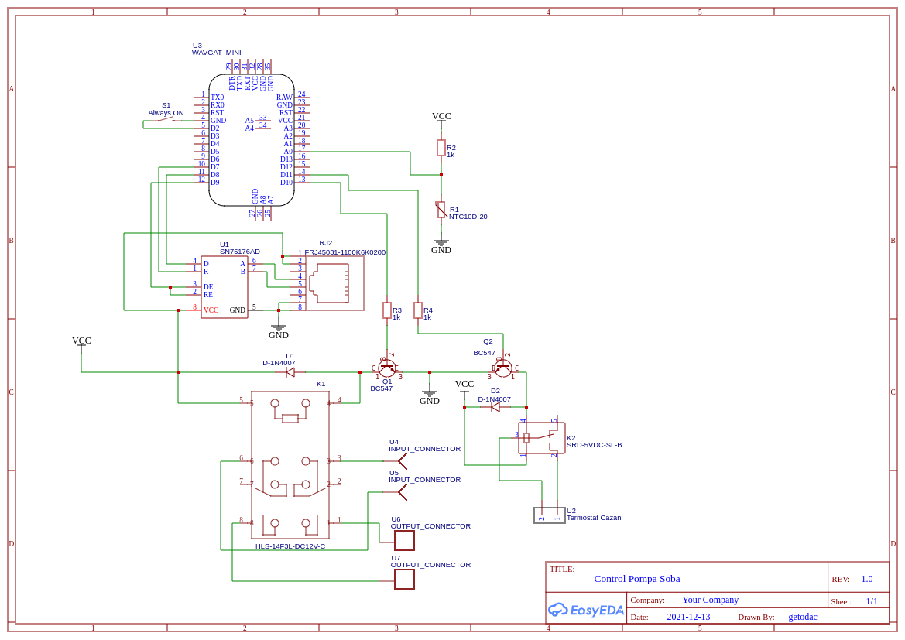
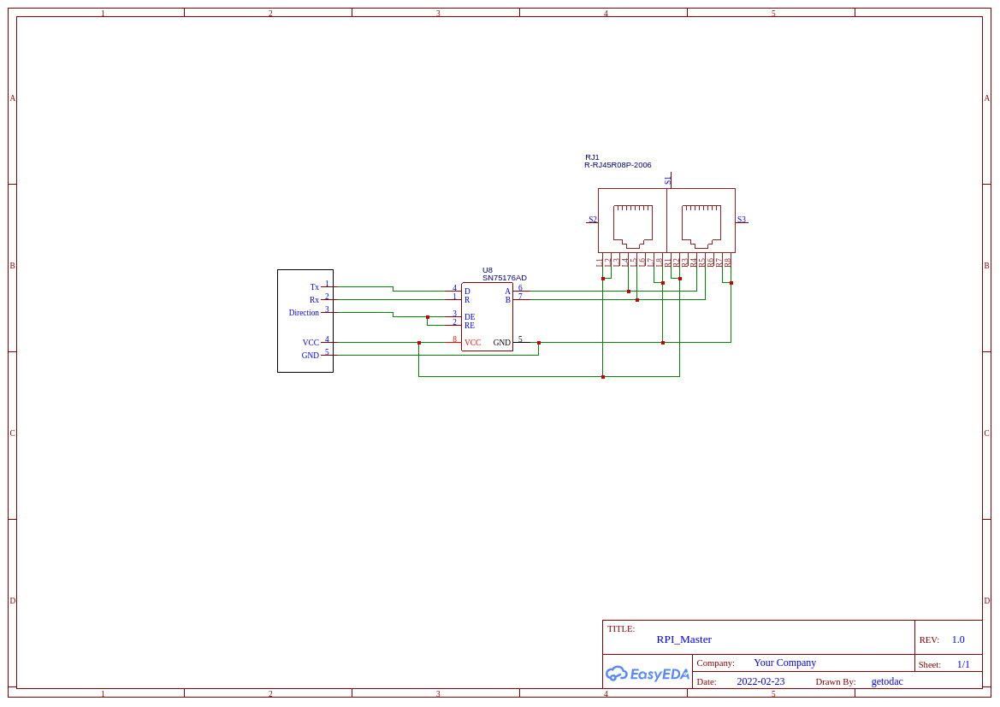

# Electronic diagram 
The diagrams have been drawn with [EasyEDA](https://easyeda.com/) (daculiber acc)

### Input Registers
 - currentTemp (NTC sensor)
 - Dallas sensor temperature

### Holding Registers
 - lastTemp (last measured temperature, probably to see if is a difference?)
 - startPumpTemp (the temperature when to start the pump)
 - startStopTempDelta

### Coils
 - remoteCtrl - remote control
 - gasBoilerOn
 - stovePumpOn
 - (new) Relay 1 (or Pump 1)
 - (new) Relay 2 (or Pump 2)
